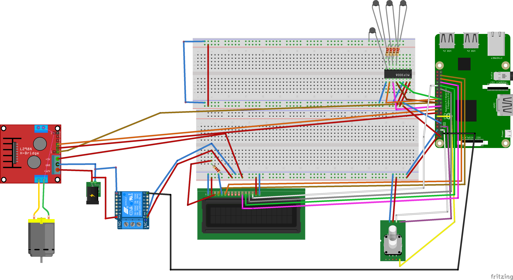
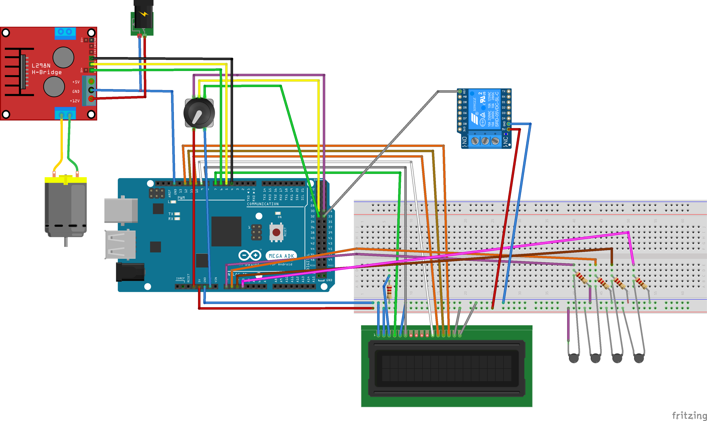
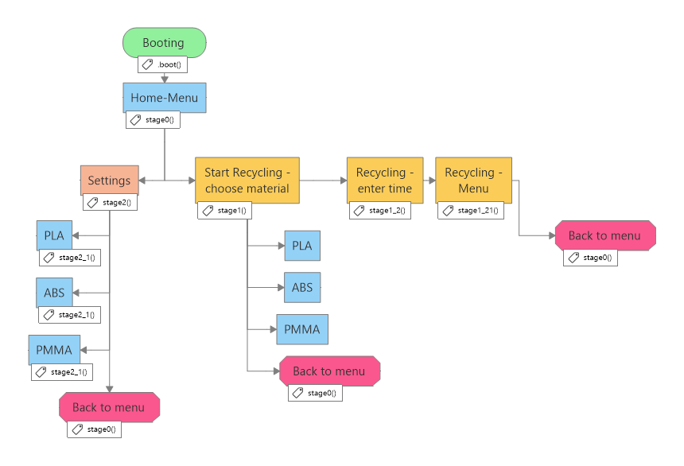
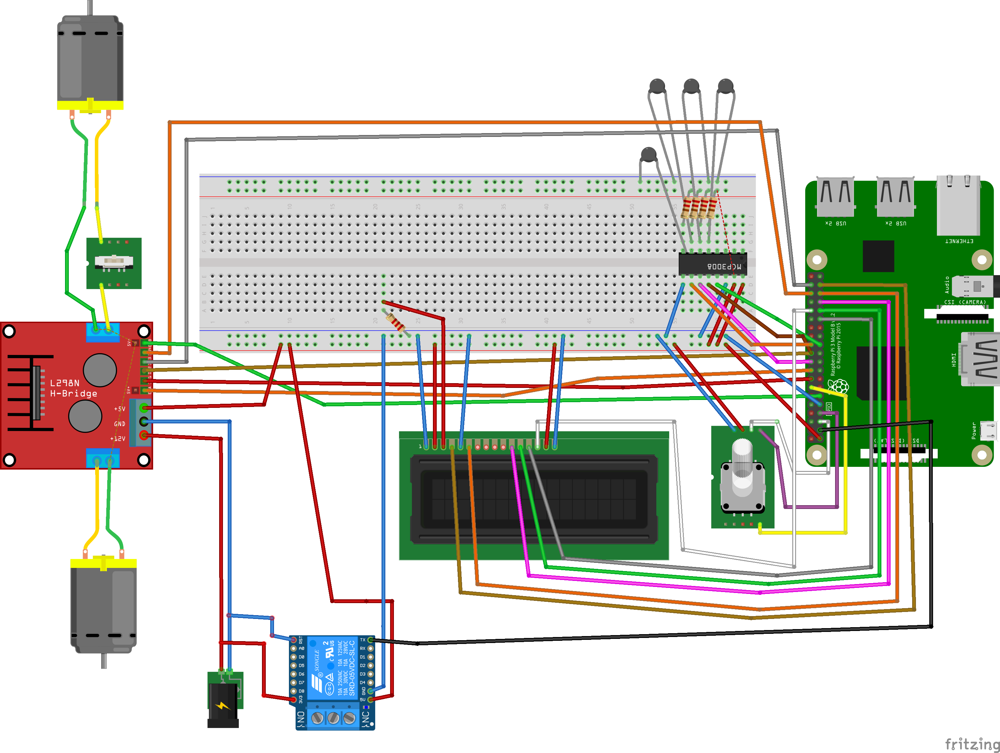
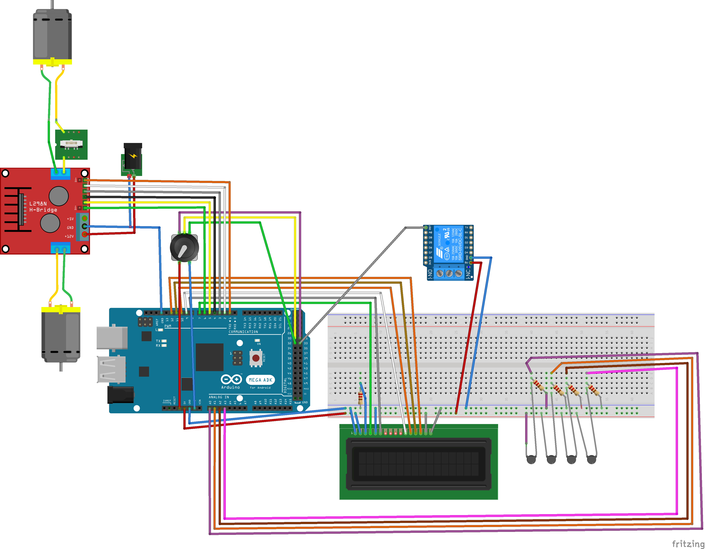
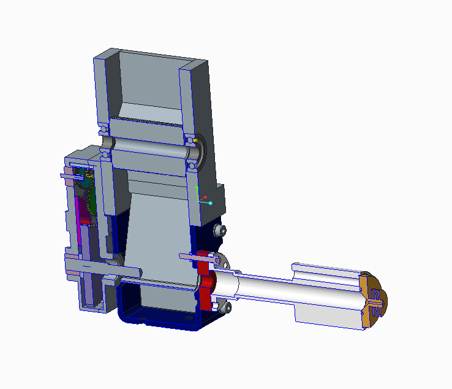
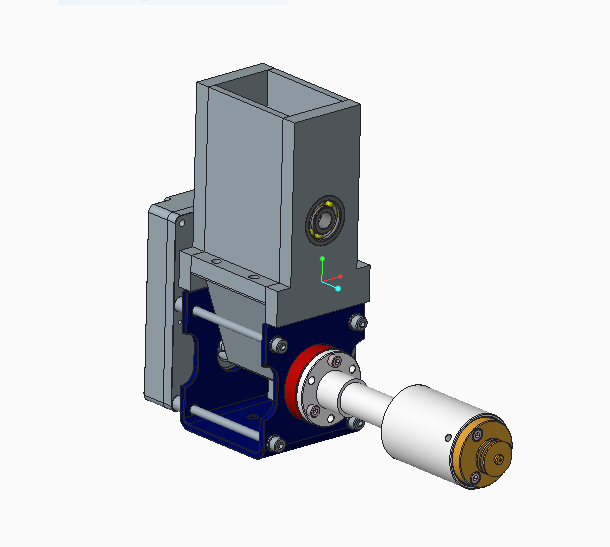
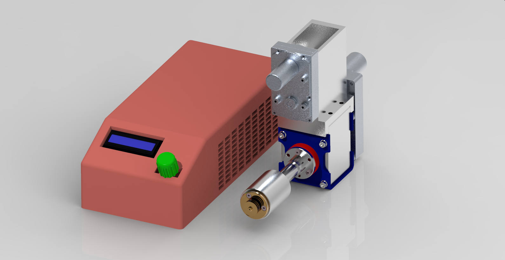
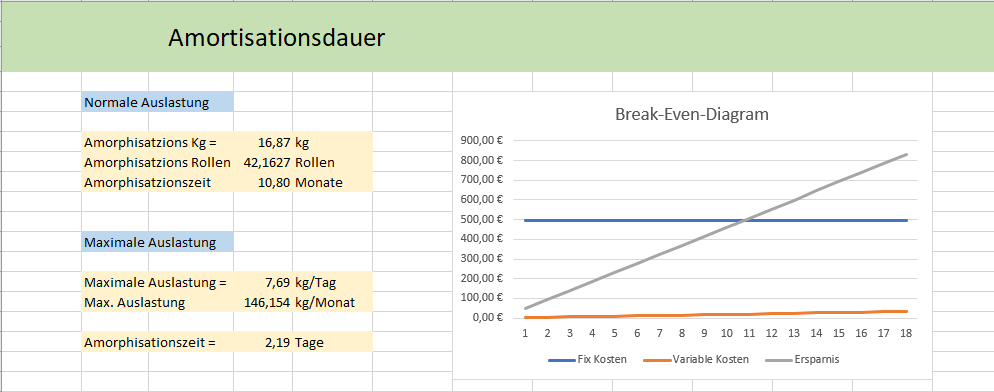

# RePrint

RePrint is a <strong>Open source 3D Printing-Filament-Recycler-Project based on the Base Kit from FelFil Vevo</strong>. 
Here you can find a Bom( Bill of materials ) and my software.

This Project was in collaboration with HTL Jenbach.

We built a fully functional 3D-Printing-Waste Recycler, which is based on the Base Kit from FelFil.
Additional to building and improving the Kit from FelFil we also constructed and built Crusher for larger waste.

<h3>Version 1 - Only Base Kit </h3>

We began by building the Kit, for which we needed to develop the electronic circuit. We made to option one to work with the Raspberry Pi and on for the Arduino.
Raspberry Pi electrical plan:  
Arduino electrical plan:  

We also needed to build a Software to test/control it. 
I wrote the Version for the Raspberry Pi, which can be found in this Repository. 
The following image is a flow-chart of the diffrent states the Program has and how they connect to each other:  
 
<h3>Version 2 - With Crusher</h3>
As mentioned we also built a Version with a Crusher, so all the Material has (more or less) a uniform size, which is better in the extrusion Process.

We also made Electrical Plans with Raspberry Pi and Arduino for this Version:
Raspberry Pi electrical plan:  
Arduino electrical plan:  
As seen in these plans we decided that the crusher should be controlled by a manual switch, for safety reasons. We've also included some mechanical safe guards so nobody could get hurt using the Recycler. 
<h4>3D-Construction and Renders</h4>

A image of the Recycler cut in half (!extruder screw not displayed):  
Image of the full Recycler:   

A render of the full Recycler:  

<h4>Economic viability</h4>

To conclude we also calculated the economical viability of our Recycler. 
Our Calculated payback time calculation (Sorry only available in German):   
<h4>If you have any questions or just want to know more about this project please contact me :D<h4>
